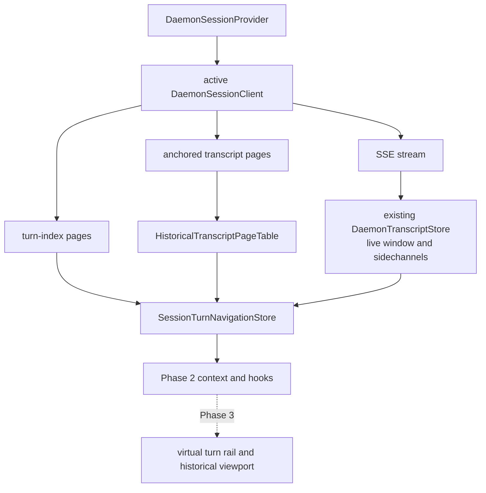

# Web Shell global turn navigation Phase 2 implementation plan

- Status: In progress — Phase 2A implemented; Phase 2B pending
- Date: 2026-09-04
- Base: `cf44c778c0775d640560143828d851fa30dbd893`
- Tracks: [#10750](https://github.com/QwenLM/qwen-code/issues/10750)
- Consumes: merged Phase 1 protocol [#10751](https://github.com/QwenLM/qwen-code/pull/10751)
- Architecture: `docs/design/web-shell/web-shell-global-turn-navigation.md`

## Outcome

Phase 2 will deliver the complete headless client data layer for session-wide
turn navigation. It will load bounded turn-index metadata independently of
transcript blocks, open arbitrary persisted turns into an immutable historical
page table, preserve the connected live transcript, reconcile live prompts by
exact identity, and expose stable locators for the Phase 3 rail.

The central implementation decision is to keep the existing
`DaemonTranscriptStore` as the live window. Random historical pages do not
reset, wrap, or append to that store. They live in a second external store as
immutable, proven-contiguous ranges. This keeps current permissions, Todo,
streaming, replay, prompt settlement, repair, and loaded-only rail behavior
unchanged while the new data layer lands.

Phase 2 changes only `packages/web-shell`. It consumes the existing SDK
contract and adds no daemon route, protocol field, dependency, or persisted
browser cache.

## Why this boundary is correct

The currently shipped timeline is derived from the loaded `messages` array,
uses reducer-local message IDs, computes an O(transcript text) signature, and
mounts its local entries. The provider also keeps one mutable transcript array
and prepends older history through `store.reset()`. That is correct for a
contiguous live window but cannot represent arbitrary history without either
discarding live output or pretending unrelated pages are adjacent.

Phase 1 now provides both missing server primitives:

- a sparse page with exact `totalTurns`, frozen snapshot, durable record UUID,
  ordinal, kind, and bounded public preview; and
- a bounded transcript read at `atRecordId` under the same snapshot, with
  safe replay-boundary expansion and forward/backward continuation.

The tracking issue assigns both the turn-index store and transcript page table
to Phase 2. This plan follows that newer boundary. Phase 3 will only render and
operate the virtualized rail.

## Ownership and data flow



Every index and anchored transcript request is issued through the provider's
current `DaemonSessionClient`. The data layer is therefore live-session-owner
scoped. It does not instantiate a client, infer a workspace, call a
workspace-qualified route directly, or fall back to the primary runtime.

There is one navigation store per `DaemonSessionProvider`, so the main chat and
each split session remain isolated. The store is cleared when the provider's
session identity changes.

## Public client contract

Add one external-store context next to the existing transcript history context.
The exact exported names may follow local naming during implementation, but
the semantic surface is:

```ts
interface DaemonTurnNavigationStore {
  getSnapshot(): DaemonTurnNavigationSnapshot;
  subscribe(listener: () => void): () => void;
  loadOrdinal(ordinal: number): Promise<void>;
  locateOrdinal(ordinal: number): Promise<DaemonTurnLocation>;
  refreshHead(): Promise<void>;
  loadOlder(rangeId: string): Promise<void>;
  loadNewer(rangeId: string): Promise<void>;
  retry(): Promise<void>;
}

interface DaemonTurnNavigationSnapshot {
  sessionId?: string;
  mode: 'legacy' | 'loading' | 'ready' | 'degraded';
  fallbackReason?: 'unsupported' | 'too_large' | 'initial_error';
  totalTurns: number;
  effectiveTurnCount: number;
  indexPages: ReadonlyMap<number, TurnIndexPage>;
  provisionalTurns: readonly ProvisionalTurn[];
  historicalPages: ReadonlyMap<string, HistoricalTranscriptPage>;
  historicalRanges: readonly HistoricalTranscriptRange[];
  locations: ReadonlyMap<string, DaemonTurnLocation>;
  selected?: DaemonSelectedTurnState;
  error?: DaemonTurnNavigationError;
}

interface DaemonSelectedTurnState {
  ordinal: number;
  turnId?: string;
  status: 'loading' | 'ready' | 'unavailable';
  location?: DaemonTurnLocation;
}

interface DaemonTurnNavigationError {
  operation: 'index' | 'locate' | 'older' | 'newer';
  message: string;
  retryable: boolean;
  rangeId?: string;
  ordinal?: number;
}
```

The hook's commands above are only the consumer-facing subset. The provider
also calls `configure({ sessionId, supported, client })`,
`observeLiveBlocks(blocks)`, `recordPromptAdmitted({ promptId, label, blockId? })`,
`recordPromptRemoved(promptId)`, and `handleSessionEvent(type)`. The exported
`DaemonTurnNavigationSession`, `DaemonTurnNavigationClient`, and
`DaemonPromptAdmission` types define this ingestion contract; the client owner
must be the active `DaemonSessionClient` object, not a shared workspace client.
Queued admissions may have no `blockId`: the queue appends its display block
separately, preserving the exact `promptId` in its existing metadata. Phase 2A
joins live blocks, admissions, and indexed entries by that identity regardless
of arrival order. Until the matching display block exists, its locator remains
unavailable. This requires no SDK contract change or text-based heuristic.
Recent server-side removals are remembered (bounded to
200 prompt IDs) so an in-flight admission cannot resurrect a removed prompt.

`getSnapshot()` returns the same immutable object until a meaningful state
change occurs. Mutable LRU timestamps, in-flight promises, dirty refresh flags,
and generation counters stay private so reads do not trigger React renders.
This follows React's external-store snapshot contract.

The initial context is `legacy`. A capable daemon moves through `loading` to
`ready` only after the newest index page succeeds. An initial transient failure
uses `degraded` with a retry while leaving the existing transcript and timeline
available. Capability absence and the index-size ceiling remain atomically on
the existing loaded-only behavior.

## Turn-index store

### Page model

```ts
interface TurnIndexPage {
  start: number;
  end: number;
  snapshot: string;
  turns: readonly DaemonSessionTurnIndexEntry[];
  retainedBytes: number;
}
```

Pages are keyed by returned `start`, not by request offset assumptions. Every
page retains the snapshot that produced it; selecting an entry always uses
that page's snapshot. A snapshot from the newest page must never be combined
with a `turnId` sourced only from an older frozen page.

The first request omits `snapshot` and asks for 200 entries, which returns the
newest metadata page. A missing ordinal is loaded using the latest head
snapshot and an aligned start:

```text
start = floor(ordinal / 200) * 200
```

The response's `start`, ordinals, bounds, session ID, and page length are
validated before admission. Invalid responses fail the metadata request and
do not mutate readable state.

### Append refresh

Terminal prompt events, replay completion, and same-session reconnect schedule
a coalesced unsnapshotted head refresh. Only one refresh is in flight; another
trigger sets a dirty flag and causes one more refresh afterward.

The new head is append-compatible only when:

1. `newTotalTurns >= oldTotalTurns`;
2. old and new cached head pages share at least one ordinal, unless the old
   total was zero; and
3. every shared ordinal has exactly the same `turnId`; and
4. a durable `turnId` present in both cached and refreshed metadata has not
   moved to a different ordinal.

On success, prefix pages remain valid, overlapping tail pages are replaced,
and each retained page keeps its own frozen snapshot. If the total shrinks,
any identity differs, or non-empty histories have no overlap, increment the
chain epoch and atomically clear index pages, historical ranges, locators, and
aliases before admitting the new head.

The no-overlap reset is deliberately conservative. A terminal-triggered
refresh normally keeps the pages overlapping; a long disconnected gap may
cost metadata refetches but cannot retain the wrong active chain.

### Provisional turns

An admitted local prompt adds:

```ts
{
  provisionalId: `live:${promptId}`,
  promptId,
  label,
  blockId?: string,
}
```

`createDaemonSessionActions` receives a narrow optional callback invoked only
after daemon admission has returned the prompt ID. The callback carries the
originating live-session owner, and the provider ignores it if either that
client instance or its session ID is no longer current. Successful removal of
an accepted pending prompt removes the provisional under the same ownership
check. Peer/realtime live turns may be observed from live blocks when an exact
prompt ID or source record ID is present.

A fresh index page replaces a provisional only when:

- `entry.promptId === provisional.promptId`; or
- an exact source record ID maps both the live block and the indexed
  `turnId`.

When the exact prompt-ID match resolves a record-less optimistic user block,
retain a live `turnId -> blockId` alias until that block is evicted. This keeps
the newly durable turn on the displayed live block without guessing by
content; a chain reset clears all such aliases.

Label, timestamp, content, media count, or relative position are never used as
identity. `totalTurns` and provisional removal commit together so the effective
count does not momentarily duplicate a turn.

## Canonical locator

Block and message IDs remain reducer-local. The navigation store maintains
side tables:

```ts
interface DaemonTurnLocation {
  turnId: string;
  blockId: string;
  view: 'live' | 'historical';
  rangeId?: string;
  pageId?: string;
}
```

For each structurally changed transcript snapshot, scan user blocks and build
`recordId -> blockId` from `sourceRecordIds`. Intersect those record IDs with
cached turn IDs to build `turnId -> location`. When a block carries several
record IDs, select the one present in the turn index; never assume the first ID
is the turn head.

Pure streaming text appends do not rebuild the locator. The existing block
change summary can distinguish a tail-only append from a structural or source
identity change.

Phase 3 will translate `blockId` to the rendered message through the existing
`sourceBlockIds` projection. Phase 2 does not change `MessageList` or message
IDs.

## Historical transcript page table

### Page and range model

```ts
interface HistoricalTranscriptPage {
  id: string;
  snapshot: string;
  blocks: readonly DaemonTranscriptBlock[];
  recordIds: ReadonlySet<string>;
  firstRecordId?: string;
  lastRecordId?: string;
  retainedBytes: number;
  turnBlockById: ReadonlyMap<string, string>;
  newerRequest?: FrozenTranscriptBoundaryRequest;
}

interface HistoricalTranscriptRange {
  id: string;
  anchorOrdinal: number;
  anchorTurnId: string;
  pageIds: readonly string[];
  older: TranscriptBoundary;
  newer: TranscriptBoundary;
}

type FrozenTranscriptBoundaryRequest =
  | { kind: 'older'; beforeRecordId: string; snapshot: string }
  | { kind: 'cursor'; cursor: string }
  | {
      kind: 'gap';
      anchorRecordId: string;
      afterRecordId: string;
      snapshot: string;
    };

type TranscriptBoundary =
  | { kind: 'end' }
  | { kind: 'live' }
  | { kind: 'cached'; rangeId: string }
  | { kind: 'loadable'; request: FrozenTranscriptBoundaryRequest }
  | { kind: 'loading'; request: FrozenTranscriptBoundaryRequest }
  | {
      kind: 'error';
      request: FrozenTranscriptBoundaryRequest;
      retryable: boolean;
    };
```

A range contains only pages whose adjacency is proven by a continuation
request or exact overlap. A loadable boundary is an explicit unloaded gap.
Separate random-anchor results remain separate ranges until continuity is
proven; they are never flattened merely because both belong to one session.
An exact overlap with another retained range may use a `cached` boundary rather
than duplicating its normalized blocks. A new anchor instead replaces
overlapping cached ranges atomically: its continuation cursor follows the
whole response and cannot recover records removed by cross-range deduplication.

Each isolated transcript store normally allocates block IDs from the same
small ordinal seed. To prevent collisions when Phase 3 renders several cached
pages as one range, the page table owns a private session-local
`nextBlockOrdinal`. It seeds every page normalization from that value and
advances it synchronously from the resulting state before another response is
materialized. Each historical block ID and tool `parentBlockId` is also
namespaced by its page ID so it cannot collide with the independent live
allocator. IDs remain reducer-local implementation details; they are only
unique within the current provider epoch and are never used as protocol
locators.

### Anchored open

For a target that has no live or cached locator:

1. capture session epoch, chain epoch, and selection generation;
2. request `getTranscriptPage({ atRecordId: turnId, snapshot, limit: 200 })`;
3. reject `partial` or `replayError` without changing the current selection;
4. normalize events in an isolated transcript store with
   `suppressOwnUserEcho: false`, no connection side effects, and trimming
   disabled until whole-page admission is decided;
5. seed the isolated store from the page table's monotonic block ordinal and
   advance that allocator before another result is materialized;
6. collect exact source record IDs and map the target to a user block;
7. reject atomically if the page alone exceeds the historical cache budget;
8. admit or reuse exact-overlap pages and create a range with explicit older
   and newer boundaries; and
9. commit only if all captured generations and the active session still match.

`targetRecordId` must equal the requested `turnId`, and normalization must
produce a user block whose `sourceRecordIds` contains that ID. If the record is
valid at the server but cannot be materialized, expose an unavailable target
instead of scrolling to a nearby message.

### Continuation

Phase 2A also owns recovery after historical page eviction. A forward-fetched
page retains its actual forward continuation. A backward-fetched page instead
retains a recovery recipe containing the range's original navigation anchor,
its frozen snapshot, and the page's last record. Backward cursors are never
reinterpreted as forward cursors.

To recover newer history from that recipe, reread the original turn anchor and
walk backward to the exact retained record, holding only the current response
and its immediate newer neighbor. Admit the nearest missing page (or the
suffix following the retained record), not the whole gap. When recovery reaches
the original forward page, resume its real forward cursor. This also covers
gaps inside a long turn with no intermediate user/turn anchor. Every read and
admission remains guarded by the active client, session, chain, and boundary
request. Recovery recipes count toward the page byte budget and disappear with
their pages; no unbounded list of evicted-page metadata is retained.

Eviction prefers the opposite outer edge from the requested direction and
preserves both the selected page and the newly requested page. If neither
outer edge can be removed while preserving adjacency, admission rolls back
with a retryable window-full error. After the selection moves, manual retry
can make progress. An individually oversized page remains non-retryable.
Tail eviction restores the last retained page's forward/recovery request,
never the cursor after the removed page. Backward-only recovery can require
multiple bounded reads; ordinary random turn jumps still use a single anchor.

- Older: request `{ beforeRecordId: firstRecordId, snapshot, limit: 200 }`.
- Newer: use the retained forward cursor or resolve the explicit gap recipe.

If an older response contains only overlap or records that produce no new
block, continue with that response's opaque backward cursor; lack of a new
`firstRecordId` must not truncate otherwise available history.

The request recipe is retained on the boundary until it succeeds or becomes
terminal. A page may be linked to a range only when it was fetched from that
range's boundary. Safe replay-boundary expansion may return overlapping
records; filter exact duplicates before normalizing the joined view. Do not use
the existing local-echo content comparison in this path.

If a continuation reaches exact record overlap with the live window, mark that
boundary `live`; do not append live blocks into the historical range.

### Deduplication

Record identities, not block IDs, are the deduplication key. Page admission:

1. indexes all `sourceRecordIds` from cached pages in the current chain epoch;
2. reuses a cached page when the target and full coverage already exist;
3. removes overlapping record groups from a boundary-derived page;
4. links ranges only when fetch direction and overlap order prove adjacency;
5. keeps a separate range when continuity cannot be proven.

The legacy upward-pagination compatibility projection may retain its current
single boundary-only local echo workaround. That exception is not shared with
the global page table and never reconciles rail identity.

## Existing transcript history migration

Do not delete the `DaemonTranscriptHistory` public hook in Phase 2. Replace its
private `transcriptHistoryRef`/React state ownership with a compatibility view
of the new data layer's live older boundary:

- `hasMore`, `loading`, `capacityReached`, and `paginationError` keep their
  current semantics;
- `loadMore()` asks the page table for the next live-adjacent older page;
- an admitted page is still projected into the existing live store using the
  current atomic prepend helper, so the shipped UI is unchanged;
- compatibility admission continues to use the live store's existing count and
  byte budgets, not the smaller random-history cache budget, and need not keep
  a second cached copy of the page;
- the page table owns the request generation, exact record dedup, boundary,
  rejected-page footprint, and retry state; and
- all existing pagination tests remain required.

This migration should be the final Phase 2 slice. Random historical pages can
then use the same normalization, admission estimates, failure taxonomy, and
generation rules without forcing the Phase 3 viewport into this PR.

## Lifecycle and race rules

Maintain three monotonic counters:

- `sessionEpoch`: session/client ownership changes;
- `chainEpoch`: rewind, divergence, or snapshot replacement;
- `selectionGeneration`: each user locate request.

Every async operation captures the counters it depends on. A late result may
populate no cache and change no status when any captured value differs. The
SDK methods do not expose abort signals, so logical cancellation is the
correct contract.

| Event                             | Action                                                            |
| --------------------------------- | ----------------------------------------------------------------- |
| different session ID              | increment session epoch; clear everything                         |
| capability absent                 | enter legacy; issue no new requests                               |
| initial supported load            | fetch newest index independently of body replay                   |
| same-session delta reconnect      | retain readable state; coalesced head refresh                     |
| replay snapshot reconnect         | retain current view until head comparison commits                 |
| `session.rewound`                 | increment chain epoch; clear index/pages/aliases; fresh head      |
| branch                            | new session identity; new store state                             |
| transient index error             | retain transcript/cache; expose retry                             |
| `transcript_snapshot_unavailable` | keep view; fresh head; require explicit locate retry              |
| `invalid_turn_anchor`             | keep view; refresh head; mark selected turn unavailable if absent |
| `transcript_too_large`            | latch loaded-only fallback for this session                       |
| later selection                   | increment selection generation; older result cannot commit        |

## Memory and eviction

Initial internal constants:

| Resource              |             Page size | Page cap | Byte cap |
| --------------------- | --------------------: | -------: | -------: |
| turn-index metadata   |           200 entries |       16 |    4 MiB |
| historical transcript | 200 requested records |        5 |   16 MiB |

Both count and byte limits apply. Metadata estimates include labels, details,
IDs, timestamps, snapshot strings, arrays, and entry overhead. Transcript
estimates reuse `estimateDaemonTranscriptBlockBytes` and include boundary
tokens and indexes.

Unreconciled provisional turns are capped at one metadata page. Reaching that
cap latches the existing loaded-only fallback rather than letting an extended
turn-index outage grow client state with session length.

Eviction order:

1. inactive historical ranges, least recently used first;
2. outer pages of the active range;
3. unselected metadata pages, least recently used first.

The selected target page, active range, newest metadata page, and metadata page
containing the selected ordinal are pinned. A page that alone exceeds its
entire cache budget fails atomically. Eviction converts the removed direction
back into an explicit loadable boundary and never joins its neighbors.
If the pinned selection prevents retaining the newly requested page, admission
rolls back with a retryable window-full error; moving the selection permits a
manual retry. A page that alone exceeds the byte budget is non-retryable.
Neither local budget error is the session-wide `transcript_too_large` fallback;
cached content stays usable.

Head-refresh retry state is tracked independently of the visible operation
error. A successful locate or boundary load clears only its own error, and
`retry()` also retries a failed head refresh even when another operation had
priority in the error slot.

The existing live store retains its current block/byte caps. Phase 2 therefore
adds bounded caches without making total retained data depend on session
length.

## Delivery slices

Deliver Phase 2 in two reviewable PRs under #10750. The issue's Phase 2
checkboxes remain open until both land.

### Phase 2A: headless index and random historical cache

1. Add internal constants and the pure navigation/page-table stores.
2. Add immutable snapshots, metadata paging, append comparison, exact
   provisional reconciliation, locators, anchored open, range continuation,
   deduplication, and LRU admission.
3. Integrate one store instance into `DaemonSessionProvider` and expose a
   context/hook.
4. Fetch the initial head on capable sessions; keep all existing visible UI on
   the legacy transcript path.
5. Add the narrow prompt-admitted callback and lifecycle invalidation.
6. Add pure store tests and focused provider tests.

Expected production scope: `packages/web-shell` only, primarily two new pure
store files plus provider/action/export wiring. If production logic approaches
1,000 added lines, split page-table admission from provider integration rather
than widening the PR.

### Phase 2B: migrate existing sequential pagination

1. Move current backward-boundary and request-generation ownership into the
   page table.
2. Preserve the existing atomic prepend compatibility projection and all
   public history-hook semantics.
3. Remove superseded provider-local history state only after parity tests pass.
4. Add continuation, trim/re-anchor, retry, and stale-result tests covering both
   legacy upward pagination and random ranges.

After 2B, Phase 3 can consume the new hook and switch the rendered viewport
without revisiting data ownership.

## Implementation map

| Area                                                                 | Change                                                                                                |
| -------------------------------------------------------------------- | ----------------------------------------------------------------------------------------------------- |
| `packages/web-shell/client/constants/sessions.ts`                    | Add internal capability and cache defaults.                                                           |
| `packages/web-shell/client/daemon/session/turn-navigation-store.ts`  | Immutable external store, metadata cache, provisionals, locator, generations, fetch orchestration.    |
| `packages/web-shell/client/daemon/session/transcript-page-table.ts`  | Immutable page/range admission, exact overlap, boundaries, memory policy, eviction.                   |
| Collocated `*.test.ts` files                                         | Pure state-machine, range, dedup, and eviction coverage.                                              |
| `packages/web-shell/client/daemon/session/DaemonSessionProvider.tsx` | Bind active session readers, observe lifecycle/live blocks, provide context, preserve existing store. |
| `packages/web-shell/client/daemon/session/actions.ts`                | Optional exact prompt-admission/removal callbacks.                                                    |
| Session/index export barrels                                         | Export the hook/types needed by Phase 3.                                                              |
| `DaemonSessionProvider.test.tsx` and `actions.test.ts`               | Capability, session isolation, initial load, prompt reconciliation, reconnect/rewind, and fallback.   |

No Phase 2 change is planned in `packages/core`, `packages/cli`,
`packages/acp-bridge`, `packages/sdk-typescript`, `MessageList`, CSS, or i18n.

## Verification matrix

### Pure turn-index store

- newest page reports the exact total while only one page is retained;
- arbitrary ordinal loads one aligned metadata page;
- pages keep and use their own snapshot after append;
- append refresh retains prefix pages only on exact overlap;
- shrink, mismatch, and no-overlap refresh reset the lineage;
- prompt and record identity reconcile provisionals atomically;
- identical labels/timestamps never reconcile distinct turns;
- metadata eviction leaves logical count/placeholders intact;
- stale session/chain/request results cannot commit;
- 409 refresh and 413 loaded-only fallback preserve readable state.

### Pure transcript page table

- first, middle, and last anchors map the exact `turnId` to a user block;
- anchored page exposes older/newer boundaries correctly;
- forward and backward continuation do not skip records;
- replay-boundary overlap deduplicates exact persisted records;
- identical content with different record IDs remains distinct;
- non-boundary random pages stay in separate ranges;
- target/page/active-range pinning and LRU eviction obey both budgets;
- page-too-large, partial, corrupt, and unmaterialized-target failures are
  atomic;
- later selection, rewind, session change, and snapshot refresh drop stale
  results;
- live-store blocks continue changing while a historical range is selected.

### Provider and action integration

- capability present triggers one non-blocking initial head request;
- capability absent issues no index/anchor request and preserves the current
  hook behavior;
- index failure does not fail session load, streaming, permission, or Todo;
- requests use only the active `DaemonSessionClient`;
- main and split providers do not share pages or generations;
- prompt admission adds one exact provisional and removal clears it;
- terminal/reconnect triggers coalesce head refreshes;
- rewind clears the old chain before fresh metadata commits;
- branch/session replacement ignores all late old-session results;
- current history pagination tests remain green after Phase 2B.

### Commands

Run focused tests from the package directory:

```bash
cd packages/web-shell
npx vitest run client/daemon/session/turn-navigation-store.test.ts
npx vitest run client/daemon/session/transcript-page-table.test.ts
npx vitest run client/daemon/session/actions.test.ts
npx vitest run client/daemon/session/DaemonSessionProvider.test.tsx
```

Then run repository verification:

```bash
npm run build
npm run typecheck
npm run lint
git diff --check
```

Phase 2 has no visible product behavior, so it does not add browser E2E. Phase
3 owns real-browser tests for virtual rendering, focus, scrolling, rapid jumps,
live append during historical inspection, fallback, and accessibility.

## Acceptance mapping

| #10750 acceptance criterion                                 | Phase 2 evidence                                                         |
| ----------------------------------------------------------- | ------------------------------------------------------------------------ |
| bounded initial load reports exact durable count            | initial turn-index store test                                            |
| navigate to any indexed turn with bounded downloads         | ordinal paging plus anchored-open tests                                  |
| memory remains bounded                                      | count/byte admission and LRU tests                                       |
| live output continues during historical inspection          | separate live-store integration test                                     |
| identity survives prepend/eviction/reconnect/replay/restart | record locator and lifecycle tests                                       |
| workspace requests never fall back                          | active-session-client provider test plus unchanged Phase 1 routes        |
| previews expose no private payloads                         | Phase 1 producer tests; Phase 2 treats strings as untrusted display data |
| older daemons retain current behavior                       | capability-absent provider regression                                    |

## Risks and mitigations

### Provider size and reviewability

`DaemonSessionProvider.tsx` is already large. Keep page-table and state-machine
logic in pure collocated modules; provider code should only bind lifecycle,
normalization, and context. Split 2A again if the new provider wiring becomes a
second state machine.

### Local echo identity

The current backward-pagination path has a narrow content comparison for a
record-less local echo. It must not leak into navigation identity. New prompts
have exact accepted prompt IDs; older record-less content simply waits for a
durable index entry and is not guessed.

### Hidden historical side effects

Normalizing an old page must not update connection state, permissions, Todo,
goal state, or prompt status. Only blocks and local page indexes are retained.
The live store remains the sole session-sidechannel authority.

### Snapshot churn

Opaque snapshot tokens make client lineage proof deliberately conservative.
Exact overlap is sufficient for ordinary append; lack of proof clears cached
pages. Correctness is preferred over metadata-cache hit rate.

## Deferred to Phase 3

- virtualized rail DOM and placeholder ticks;
- keyboard navigation and WAI-ARIA attributes;
- tooltip, selected/loaded/unavailable visual states;
- switching `MessageList` between the live store and a historical range;
- block-to-rendered-message focus and flash;
- scroll-position preservation and jump-to-latest presentation;
- compact/mobile/split-view presentation decisions; and
- real-browser performance and accessibility E2E.

TanStack Virtual already supports logical item counts, stable keys, visible
ranges, and overscan, while WAI-ARIA defines `aria-setsize` and
`aria-posinset` for partially rendered sets. Phase 2 supplies the exact total,
ordinal metadata loader, and stable record identity those APIs need; it should
not pre-build UI-specific arrays.

## Primary references

- [React `useSyncExternalStore`](https://react.dev/reference/react/useSyncExternalStore)
- [TanStack Virtual API](https://tanstack.com/virtual/latest/docs/api/virtualizer)
- [WAI-ARIA 1.2](https://www.w3.org/TR/wai-aria/)
- [Tracking issue #10750](https://github.com/QwenLM/qwen-code/issues/10750)
- [Merged Phase 1 PR #10751](https://github.com/QwenLM/qwen-code/pull/10751)
